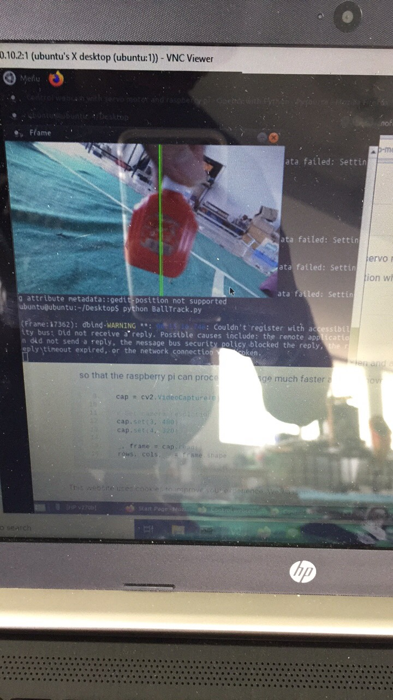
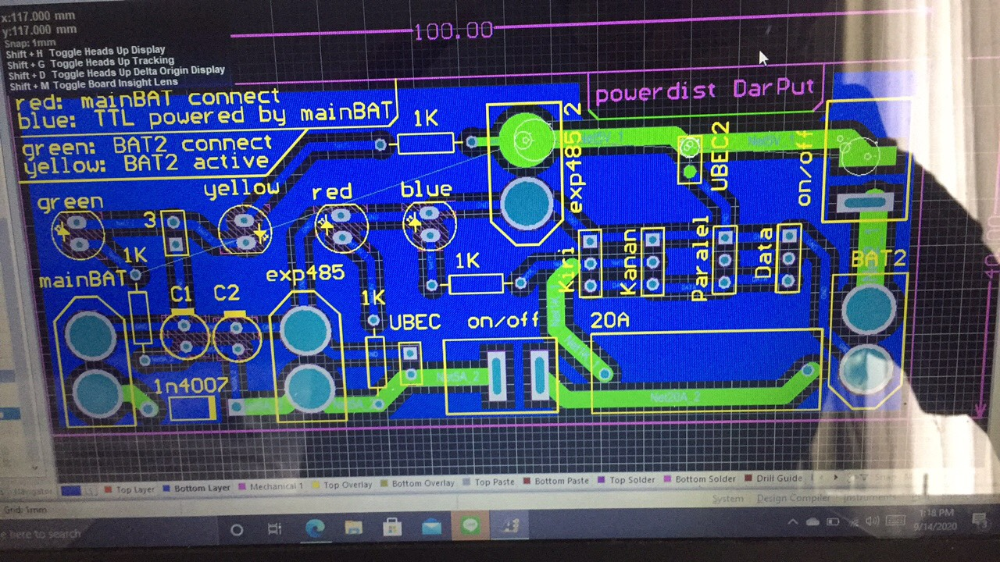
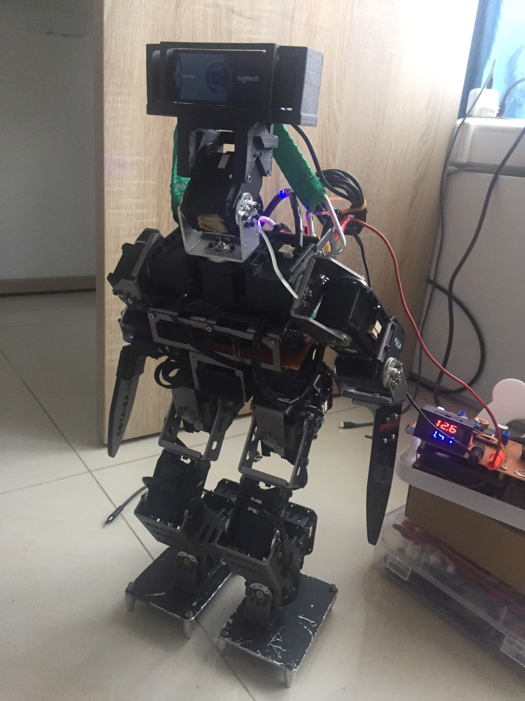
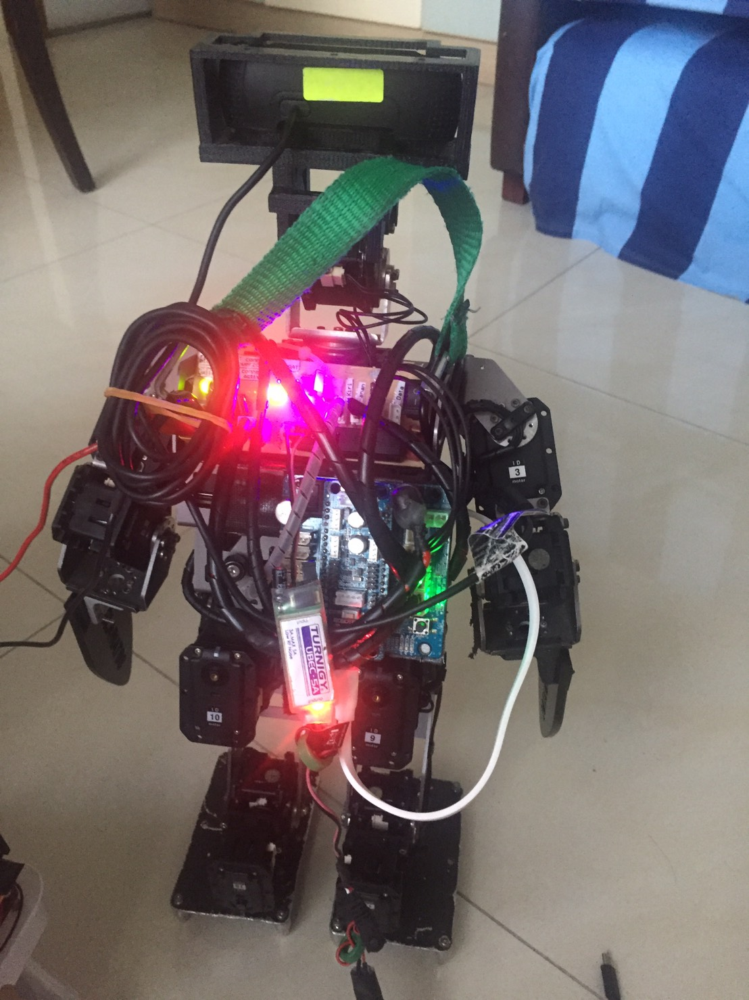

# Gladiatos
All projects related to humanoid robot team Gladiatos

In the RaspberryPi 4.txt is all the notes that i have taken from developing the humanoid robot. you can find how to setup rasberryPi4, using PuTTY to have ssh connection, use VNCviewer to have the desktop running in your Laptop, download openCV, download ROS, and how to programming in linux environment. 

For you who want to develop custom DarwinOP2, you can try this several codes and wiring diagram for references. in the kinematics folder, you can find the code Run_with_delay. this code runs on OpenCM9.04 but upload it using the OpenCM IDE. this will make the robot runs forward, turn right, and turn left (can be adjusted on which movement should be performed next) for a desired period of time. 

In the vision folder, you can see there are BallTrack.py code. this will track red objects using openCV and send command serially to the OpenCM9.04. the code for the OpenCM9.04 to react to the serial data can be found in kinematics/BallTrackBackup.ino

overall this is the hardware connection of the custom DarwinOP2:

For the power distribution board, you can get the schematic and PCB in the Powerdist folder. I uses Altium designer to make it.

In case you are wondering about the looks of the custom DarwinOP2 robot, here are some screenshot that i take before he goes into battle :)

